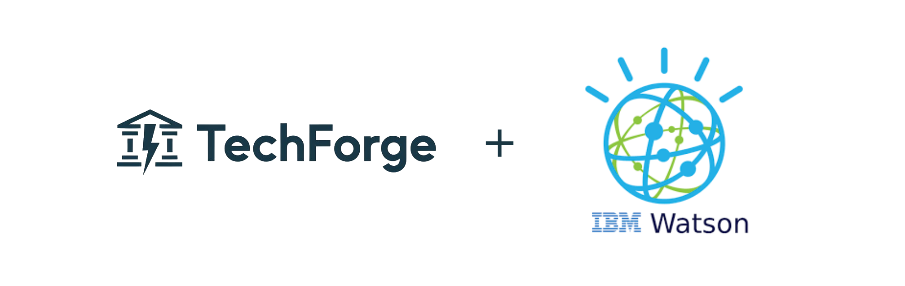

# HISTORIANS IT team x TECHFORGE

## Current Situation

TechForge Industries is seeking a comprehensive audit of AI tools to integrate into their software development process. Our goal is to evaluate potential tools, analyze their benefits, risks, and recommend the best options. This report focuses on AI tools that can improve team efficiency, enhance end-user experience, and secure customer data, all while mitigating risks.

---
## Our recommendation

After reviewing various AI technologies, we recommend integrating an AI chatbot into TechForge’s banking app to enhance user experience and streamline customer support. Below, we outline the opportunity, risks, tangible benefits, and evaluation.

---

## ⚖️ **Opportunity**

### **Problem Solved**

Chatbots in banking apps provide 24/7 customer service, guiding users through complex processes like transfers, loans, or account management. This can reduce the workload for human agents and improve user engagement.

---

## ⚠️ **Risk**

| **Aspect**          | **Details**                                                                                      |
|---------------------|--------------------------------------------------------------------------------------------------|
| **Potential Downsides** | Chatbots may fail to understand context or provide incorrect advice, leading to user frustration. |
| **Security Flaws**      | If not properly secured, chatbots can be vulnerable to hacking attempts, exposing sensitive data. |
| **Public Concerns**     | Chatbots have been involved in data breaches or privacy issues, such as the Facebook Messenger bot scrutiny ([TechCrunch](https://techcrunch.com/2019/08/13/ibm-says-it-will-stop-selling-ai-powered-predictive-policing/)). |

---

## 💰 **Tangible Benefit**

| **Benefit**         | **Details**                                                                                              |
|---------------------|----------------------------------------------------------------------------------------------------------|
| **Cost Savings**    | Reduces the need for large customer support teams, as chatbots handle common tasks and inquiries.         |
| **Productivity Gains** | Speeds up issue resolution and minimizes errors, enhancing overall user satisfaction.                   |

---

## 🧮 **Evaluation**

### **Benefit vs. Risk**

Well-designed chatbots, like IBM Watson, come with advanced security features and the capability to escalate issues to human agents if needed. This minimizes risks and ensures secure and effective user interactions.

### **Recommendation**

We recommend TechForge adopt IBM Watson for their chatbot solution. IBM Watson is renowned for its robust AI capabilities and its successful integration with banking platforms. It has been used by major banks to deliver secure, customizable, and highly effective customer support, making it a strong choice for enhancing TechForge’s banking app.

---

## 🛠️ **Mini Tutorial: Implementing IBM Watson Chatbot**

1. **Set Up IBM Watson Account:**  
   Sign up for an IBM Cloud account and create a Watson Assistant service instance.

2. **Design the Chatbot:**  
   Use Watson Assistant to create intents (user goals), entities (important terms), and dialogues (responses).

3. **Integrate with Banking App:**  
   Connect the chatbot with your banking app using the IBM Watson API. Ensure secure API calls and integrate with your existing backend systems.

4. **Train and Test:**  
   Continuously train the chatbot with real user data and test its performance to meet your requirements.

5. **Deploy:**  
   Launch the chatbot in your banking app and monitor its performance for further improvements.

**Estimated Time & Cost:**  
Implementing the chatbot can take approximately 3-6 months, depending on complexity. For a bank with around 100,000 users, costs can range from $50,000 to $150,000, depending on customization and integration needs.

---

## 📊 **Pros and Cons of IBM Watson**

### **Pros:**

- **Advanced AI Capabilities:** Sophisticated natural language processing and machine learning.
- **Integration with Banking Platforms:** Successfully used in various banking environments.
- **Strong Security Features:** Includes advanced security measures to protect sensitive data.
- **Cost Efficiency:** Reduces the need for large support teams.
- **Productivity Gains:** Enhances issue resolution speed and reduces errors.

### **Cons:**

- **Security Concerns:** Past scrutiny over security practices, though no major breaches reported ([TechCrunch](https://techcrunch.com/2019/08/13/ibm-says-it-will-stop-selling-ai-powered-predictive-policing/)).
- **Public Concerns:** Criticisms regarding AI ethics, particularly in healthcare ([MIT Technology Review](https://www.technologyreview.com/2019/01/29/ibm-watson-ai-wasnt-a-very-good-doctor/)).
- **Complexity of Implementation:** Requires significant time and resources for proper setup and training.

---
---

**Customer Rating:**  
Generally rated around 4.2 out of 5 on [Gartner](https://www.gartner.com/reviews/market/ai-platforms/vendor/ibm/product/ibm-watson) and [Capterra](https://www.capterra.com/ai-software/marketplace/ibm-watson).

---
---
